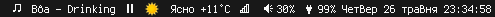

boa-font
========
An iconic 16x16 bitmap font. Perfectly matches with terminus font.

preview
-------


statusbars
----------
 - dwm<br>
 

neovim
------
[nvim-gps](https://github.com/SmiteshP/nvim-gps):<br>


[lspkind-nvim](https://github.com/onsails/lspkind.nvim):<br>


Lua code snippets for `nvim-gps` and `lspkind-nvim` initialization with my icons:
```lua
require('lspkind').init({
    symbol_map = {
    Text = " ",
    Method = " ",
    Function = " ",
    Constructor = " ",
    Field = " ",
    Variable = " ",
    Class = " ",
    Interface = " ",
    Module = " ",
    Property = " ",
    Unit = " ",
    Value = " ",
    Enum = " ",
    Keyword = "  ",
    Snippet = " ",
    Color = " ",
    File = " ",
    Reference = " ",
    Folder = " ",
    EnumMember = " ",
    Constant = " ",
    Struct = " ",
    Event = " ",
    Operator = " ",
    TypeParameter = " "
    },
})
```
```lua
require("nvim-gps").setup({
    icons = {
        ["class-name"] = '  ',      -- Classes and class-like objects
        ["function-name"] = '  ',   -- Functions
        ["method-name"] = '  ',     -- Methods (functions inside class-like objects)
        ["container-name"] = '  ',  -- Containers (example: lua tables)
        ["tag-name"] = '  '         -- Tags (example: html tags)
    },
})
```

installation
------------
Clone repo and run `install.sh`

editing and adding new icons
---------------------------
Use FontForge. Project file is `boa-font.sfd`
